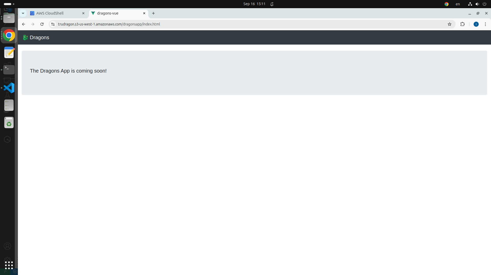

# Exercise 1: Setting up and Boto3

---

**Note**: The exercises in this course will have an associated charge in your AWS account. In this exercise, you create the following resources:

- AWS Identity and Access Management (IAM) policy and user (Policies and users are AWS account features, offered at no additional charge)
- Amazon Simple Storage Service (Amazon S3) bucket, with the dragons data
- AWS Systems Manager Parameter Store parameters
- AWS Cloud9 integrated development environment (IDE)

Make sure to delete all the resources that you create in the exercises.

Familiarize yourself with [Amazon S3 pricing](https://aws.amazon.com/s3/pricing/), [AWS Systems Manager pricing](https://aws.amazon.com/systems-manager/pricing/), and the [AWS Free Tier](https://aws.amazon.com/free/).

---

In this exercise, you install and configure the AWS Command Line Interface (AWS CLI) and the AWS SDK for Python (Boto3). After you install the necessary requirements, you create an S3 bucket and deploy a web application to the bucket. You then set up data in Amazon S3, and configure AWS Systems Manager parameters for the Dragons application. After you create all the resources, you explore the Python application.

You will want to run the steps in the US East (N. Virginia) us-east-1 Region.

## Task 1: Creating an AWS CloudShell environment

For this task, you will use AWS CloudShell environment, which you will use as your development environment throughout the exercises.
In the AWS Management Console, choose Services, and then search for and CloudShell.

---

**Note**: For this exercise, we'll be using [AWS CloudShell](https://aws.amazon.com/cloudshell/), a cloud-based tool that doesn't require any local installation. While this makes it convenient to get started, it's important to note that it's a command-line environment. If you prefer to write your code in a more visual IDE like VSCode, you can set up a local development environment using the following guide:

- [AWS CLI](https://docs.aws.amazon.com/cli/latest/userguide/getting-started-install.html)
- [AWS Toolkit for Visual Studio Code](https://docs.aws.amazon.com/toolkit-for-vscode/latest/userguide/setup-toolkit.html)

But, I recommend using AWS CloudShell for now and setting up your preferred environment later, since it might take some time to learn how to set it up locally.

---

### Python and boto3

For this lab, we'll be using Python3 and the Boto3 library. Boto3 is the AWS SDK for Python, providing an interface to interact with AWS services from your Python code. AWS CloudShell already has Python 3 and Boto3 installed, so you don't need to install them locally. To check if Python 3 is installed, run the following command:

```bash
python3 --version
pip install boto3
```

In general, you'll need basic command-line knowledge. If you're new to the command line or need a refresher, here's a helpful resource:

- [Unix Basic - Navigating](https://keshvadi.github.io/linux/Basic%20Commands/navigation.html)
- [Unix Basic - File Manipulation](https://keshvadi.github.io/linux/Basic%20Commands/file_manipulation.html)
- [Coding with the Shell](https://keshvadi.github.io/linux/Use%20Cases/coding.html#python)

## Task 2: Creating an S3 bucket

In this task, you will create an S3 bucket. This bucket will store the web application frontend. AWS Command Line Interface (AWS CLI) commands are supplied for use in your AWS CloudShell or local IDE terminal.

1. In the AWS CloudShell or the local IDE terminal, run the following commands. The first command prompts you to enter a unique bucket name. For example, you could combine your initials and -dragons-app to create a bucket name (such as hjs-dragons-app). This command also saves your bucket name as an environment variable. Then, the second command creates a bucket.

Ensure that you run the steps in the US East (N. Virginia) us-east-1 Region.

First, create a bucket name and save the bucket name as an environment variable. You can either prompt the user to enter a bucket name or set it directly.

```bash
echo "Please enter a bucket name: "; read bucket;  export MYBUCKET=$bucket
```

Alternatively, you can set the bucket name directly:

```bash
export MYBUCKET=my-bucket-name
```

The `export` command in Bash is used to create environment variables that can be accessed by other scripts and commands within the same shell session.

Then, create the bucket:

```bash
aws s3 mb s3://$MYBUCKET
```

If your bucket name isn`t unique, you will see an error message. Continue changeing the name with a new bucket name and running the command until you have successfully created a bucket.

2. After the bucket is created, make the environment variable available in future exercises by adding an entry to your `.bashrc`:

   ```bash
   echo "export MYBUCKET=$MYBUCKET" >> ~/.bashrc
   ```

3. List the buckets in your account and confirm that the newly created bucket is in the response.

```bash
aws s3 ls
```

For more information about AWS CLI commands, see the [AWS CLI Command Reference](https://docs.aws.amazon.com/cli/latest/index.html).

### Task 3: Deploying a web application to the S3 bucket

In this task, you will deploy a simple web application to the S3 bucket. Amazon S3 will become the web server for your static website, which includes HTML, images, and client-side scripts. AWS CLI instructions for copying the web application are supplied.

1. In the AWS CloudShell or local IDE terminal, download and extract the web application.

   ```bash
   wget https://aws-tc-largeobjects.s3.amazonaws.com/DEV-AWS-MO-BuildingRedux/downloads/webapp1.zip
   unzip webapp1.zip -d ~/webapp1
   ```

   Note:

   - This command uses the `wget` tool to download a file from the internet.
   - The `unzip` tool extracts the contents of the downloaded archive (webapp1.zip).
   - The provided web application contains HTML, CSS, and JavaScript files for the front-end. For this lab, you can use these files as-is. We’ll explore web development in more detail in later courses. Feel free to explore the files to learn more about front-end development, or ask your instructor if you have any questions.

2. Copy all the contents of the webapp1 folder to Amazon S3.

   ```bash
   # Set the bucket ownership to BucketOwnerPreferred
   aws s3api put-bucket-ownership-controls --bucket $MYBUCKET --ownership-controls 'Rules=[{ObjectOwnership=BucketOwnerPreferred}]'

   # Disable public access blocking for the specified bucket
   aws s3api put-public-access-block --bucket $MYBUCKET --public-access-block-configuration "BlockPublicAcls=false,IgnorePublicAcls=false,BlockPublicPolicy=false,RestrictPublicBuckets=false"

   # Copy the web application to the S3 bucket and public access control lists (ACLs) grant read access to everyone.
   aws s3 cp ~/webapp1 s3://$MYBUCKET/dragonsapp/ --recursive --acl public-read
   ```

3. To find the URL for the web application, run the following AWS CLI command.

   ```bash
   echo "URL: https://$MYBUCKET.s3.amazonaws.com/dragonsapp/index.html"
   ```

4. Visit the web application (which is hosted on Amazon S3) by copying the URL output into a browser window.
5. Confirm that your web application works. It will look similar to the following screen capture.
   
6. In your browser, bookmark this application because you will return to it in future exercises.

## Task 4: Setting up the Dragons application

In this task, you will create resources that the Dragons application will use. You will download the file that contains the dragons data in JavaScript Object Notation (JSON) format, and upload this data to your S3 bucket. Then, you will create two parameters for Systems Manager. The console application that you create after this section uses the dragons data for querying, and it uses the parameters for configuration.

1. Download the source of the dragons data: dragon_stats_one.txt.

   ```bash
   wget https://aws-tc-largeobjects.s3.amazonaws.com/DEV-AWS-MO-BuildingRedux/downloads/dragon_stats_one.txt
   ```

2. Copy the dragons data in dragon_stats_one.txt to the root of the S3 bucket.

   ```bash
   aws s3 cp dragon_stats_one.txt s3://$MYBUCKET
   ```

3. Confirm that the data populated the S3 bucket. You should see the `dragonsapp/` prefix and a `dragon_stats_one.txt` object, in addition to the other objects in the bucket.

   ```bash
   aws s3 ls s3://$MYBUCKET
   ```

Note about `dragon_stats_one.txt`: This file contains a list of predefined dragon statistics in JSON format. We will use these dragons for future lab exercises. To view the contents of the file, you can use the cat command in your terminal: `cat dragon_stats_one.txt`. This will print the JSON data to the console.

## AWS Service Management using SDK

While the AWS Management Console and CLI are powerful tools for interacting with AWS services, using a programming language like Python and the Boto3 SDK offers several advantages. For example, you can automate tasks, create complex workflows, and integrate AWS services into your custom applications. Boto3 provides a convenient and intuitive way to interact with AWS services from your Python code and allows you to perform tasks like creating buckets, uploading files, managing IAM roles, and much more.

For this exercise, we'll be working with the dragon data stored in your application bucket. Before writing the code, it's recommended to store the bucket name and other relevant data in AWS Systems Manager Parameter Store. This way, if you need to change the bucket name or other parameters in the future, you can modify them in Parameter Store without having to update your code. This makes your application more flexible and maintainable.

1. Set the Parameter Store value for `dragon_data_bucket_name`.

   ```bash
   aws ssm put-parameter --name "dragon_data_bucket_name" --type "String" --overwrite --value $MYBUCKET
   ```

2. Set the Parameter Store value for the dragon_data_file_name.

   ```bash
   aws ssm put-parameter --name "dragon_data_file_name" --type "String" --overwrite --value dragon_stats_one.txt
   ```

3. Now, we'll write a simple Python script to read the dragon data from the dragon file in the S3 bucket. Remember to replace us-east-1 with the correct region if you're using a different one. The code will use the Boto3 library to interact with S3 and retrieve the object content. Use `nano app.py` to start writing the code.

```python
import boto3

# Create S3 and SSM clients
s3 = boto3.client('s3', 'us-east-1')
ssm = boto3.client('ssm', 'us-east-1')

# Retrieve bucket name and file name from Parameter Store
bucket_name = ssm.get_parameter(Name='dragon_data_bucket_name', WithDecryption=False)['Parameter']['Value']
file_name = ssm.get_parameter(Name='dragon_data_file_name', WithDecryption=False)['Parameter']['Value']

def listDragons():
    # Retrieve the S3 object
    response = s3.get_object(Bucket=bucket_name, Key=file_name)
    # Read the object content as a string
    content = response['Body'].read().decode('utf-8')
    # Print the dragon data
    print(content)

listDragons()
```

4. You can run the file to get some dragon data from dragon_data_file_name.
   `python3 app.py`

It should return some JSON output that’s similar to the following:

```json
{
  "description_str": "From the northern fire tribe, Atlas was born from the ashes of his fallen father in combat. He is fearless and does not fear battle.",
  "dragon_name_str": "Atlas",
  "family_str": "red",
  "location_city_str": "anchorage",
  "location_country_str": "usa",
  "location_neighborhood_str": "w fireweed ln",
  "location_state_str": "alaska"
}
```

## Perform the same exercise with the SDK

In this exercise, you have followed these steps to create the infrastructure for a simple application:

- Create an S3 bucket for storage and hosting
- Deploy a web application to the S3 bucket
- Create Systems Manager parameters to store configurations

The following example script performs the same steps by using the SDK for Python.
Take your time and write the code carefully. Make sure you understand what each line of code does. Don't hesitate to ask questions if you're unsure about anything.

```python
"create dragons app script"
import os
import sys
import mimetypes
from os.path import expanduser
import boto3

s3 = boto3.client('s3')
mybucket = os.getenv('MYBUCKET')

def create_dragons_bucket():
  "create a bucket"
  s3.create_bucket(Bucket=mybucket)
  # specify the region if us-east-1 is not the default location
  # s3.create_bucket(Bucket=mybucket, CreateBucketConfiguration={'LocationConstraint': 'us-east-1'})
  print(f"Created {mybucket}")

def list_all_buckets():
  "list buckets"
  response = s3.list_buckets()

  print('Existing buckets:')
  for bucket in response['Buckets']:
    print(f'  {bucket["Name"]}')

def upload_dragons_app():
  "upload files"
  directory = expanduser('~/webapp1/')

  print('Uploading...')

  for root, _, files in os.walk(directory):
    for file in files:
      full_file = os.path.join(root, file)
      rel_file = os.path.relpath(full_file, directory)
      content_type = mimetypes.guess_type(full_file)[0]
      print(full_file)
      s3.upload_file(full_file, mybucket, 'dragonsapp/' + rel_file,
               ExtraArgs={'ACL': 'public-read','ContentType': content_type})

  print('URL: https://%s.s3.amazonaws.com/dragonsapp/index.html' % (mybucket))

def upload_dragons_data():
  "upload data file"
  cwd = os.getcwd()

  print('Uploading dragon_stats_one.txt')

  s3.upload_file(os.path.join(cwd, 'dragon_stats_one.txt'), mybucket, 'dragon_stats_one.txt')

  s3_resource = boto3.resource('s3')
  bucket = s3_resource.Bucket(mybucket)
  # the objects are available as a collection on the bucket object
  for obj in bucket.objects.all():
    print(obj.key, obj.last_modified)

def put_dragons_parameters():
  "set the SSM parameters"
  client = boto3.client('ssm')

  print('Setting parameter store parameters')

  client.put_parameter(
    Name='dragon_data_bucket_name',
    Value=mybucket,
    Type='String',
    Overwrite=True
  )

  client.put_parameter(
    Name='dragon_data_file_name',
    Value='dragon_stats_one.txt',
    Type='String',
    Overwrite=True
  )

def print_menu():
  "print options menu"
  print("1. Create the dragons bucket")
  print("2. List all buckets")
  print("3. Upload dragons app")
  print("4. Upload dragons data")
  print("5. Set parameter store parameters")
  print("6. Exit")

def main():
  "script requires MYBUCKET environment variable"
  if not mybucket:
    sys.exit("Please set MYBUCKET environment variable")
  loop = True

  while loop:
    print_menu()    ## Displays menu
    choice = input("Enter your choice [1-5]: ")

    if choice=="1":
      create_dragons_bucket()
    elif choice=="2":
      list_all_buckets()
    elif choice=="3":
      upload_dragons_app()
    elif choice=="4":
      upload_dragons_data()
    elif choice=="5":
      put_dragons_parameters()
    elif choice=="6":
      print("Exiting...")
      loop=False
    else:
      input("I don't know that option..")

main()
```
